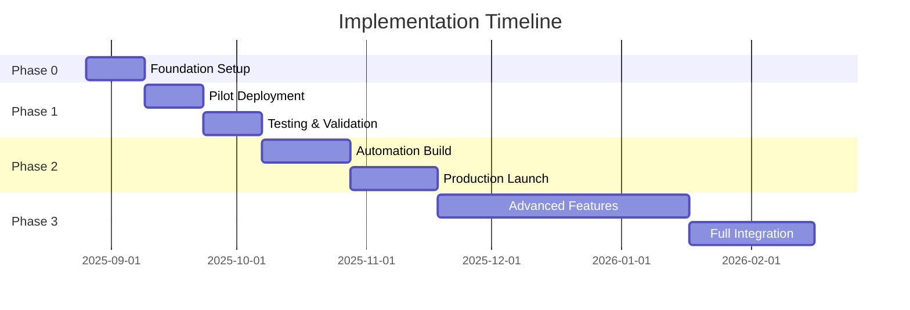

# AI Company Dossier Implementation Roadmap
*Strategic Timeline for Biotech Portfolio Management Integration*
*Version 1.0 | 2025-08-25*

## Mission Statement
Transform biotech investment analysis through AI-driven company dossiers, achieving 5x coverage expansion with maintained quality standards by Q2 2026.

---

## PHASE 0: FOUNDATION (Weeks 1-2) ✅ IN PROGRESS
*"Proof of Concept & Quick Wins"*

### Week 1 Deliverables
| Task | Owner | Status | Success Criteria |
|------|-------|--------|------------------|
| Prompt refinement v2.3 | You | 🟡 | Enhanced biotech frameworks |
| Test 3 companies (large/mid/small cap) | You | 🔴 | Accurate dossiers produced |
| Document learnings | You | 🔴 | Error patterns identified |
| Create ChatGPT 5 Pro account | IT/You | 🔴 | Access confirmed |

### Week 2 Deliverables
| Task | Owner | Status | Success Criteria |
|------|-------|--------|------------------|
| Present POC to management | You | 🔴 | Buy-in secured |
| ChatGPT 5 Pro initial tests | You | 🔴 | Feasibility confirmed |
| Source repository setup | You | 🔴 | 10 companies pre-loaded |
| Team training materials v1 | You | 🔴 | Draft complete |

### Critical Path Items ⚠️
1. Management approval for resource allocation
2. Compliance clearance for ChatGPT 5 Pro
3. IT infrastructure for document storage

---

## PHASE 1: PILOT DEPLOYMENT (Weeks 3-6)
*"Controlled Testing with Safety Rails"*

### Objective
Validate AI dossiers with 20 companies across diverse biotech segments while maintaining manual oversight.

### Week 3-4: System Setup

#### Technical Infrastructure
```
┌─────────────────────────────────┐
│     ChatGPT 5 Pro Interface     │
│         (Compliant Setup)        │
└────────────┬────────────────────┘
             │
             ▼
┌─────────────────────────────────┐
│      Document Repository         │
│  ├── /sources (Primary docs)    │
│  ├── /dossiers (Outputs)        │
│  └── /audits (QC reports)       │
└─────────────────────────────────┘
             │
             ▼
┌─────────────────────────────────┐
│    Human Review Checkpoint       │
│    (Investment Team Sign-off)    │
└─────────────────────────────────┘
```

#### Process Workflow
1. **Input**: Company ticker + focus areas
2. **ChatGPT 5 Pro**: Generate dossier using adapted prompt
3. **Automated QC**: Format validation script
4. **Human Review**: Senior analyst verification
5. **Distribution**: Approved dossiers to team

### Week 5-6: Pilot Testing

#### Coverage Plan
| Segment | Companies | Priority | Complexity |
|---------|-----------|----------|------------|
| Large Cap Biotech | 5 | High | Medium |
| Oncology Focused | 5 | High | High |
| Rare Disease | 5 | Medium | High |
| Platform Companies | 3 | Medium | Very High |
| Recent IPOs | 2 | Low | Medium |

#### Success Metrics
- ✅ <4 hours per dossier (from 2 days manual)
- ✅ <5% error rate on material facts
- ✅ 90% format compliance
- ✅ Positive feedback from 3+ team members

### Risk Mitigation
- **Parallel Processing**: Maintain manual process for critical decisions
- **Staged Rollout**: Start with well-known companies
- **Human Verification**: All numbers checked before distribution
- **Audit Trail**: Complete documentation of all outputs

---

## PHASE 2: SCALED DEPLOYMENT (Weeks 7-12)
*"Production Mode with Automation"*

### Month 2 Goals
- 50 companies covered
- Claude CLI automation operational
- Team fully trained
- Error rate <3%

### Automation Architecture

```python
# Simplified automation flow
def generate_dossier_pipeline(ticker):
    # Step 1: Gather sources
    sources = fetch_primary_sources(ticker)
    
    # Step 2: Generate via ChatGPT 5 Pro
    raw_dossier = chatgpt5_pro.generate(
        prompt=ENHANCED_DOSAG_PROMPT,
        context=sources
    )
    
    # Step 3: Audit via Claude CLI
    audit_report = claude_cli.audit(
        agent="biotech-dossier-qc-auditor",
        dossier=raw_dossier
    )
    
    # Step 4: Human review if critical issues
    if audit_report.has_critical_issues():
        return human_review_queue.add(raw_dossier)
    
    # Step 5: Auto-approve and distribute
    return distribute_to_team(raw_dossier)
```

### Parallel Track: Claude CLI Setup

#### Week 7-8: Environment Configuration
- Install Claude CLI tools
- Configure API access
- Set up automation scripts
- Test biotech-investment-dossier/biotech-dossier-qc-auditor agents

#### Week 9-10: Integration Testing
- Connect ChatGPT 5 Pro → Claude audit pipeline
- Implement error handling
- Create monitoring dashboard
- Stress test with 10 companies/day

#### Week 11-12: Production Launch
- Full automation for standard companies
- Manual override for complex cases
- Real-time monitoring
- Performance optimization

---

## PHASE 3: OPTIMIZATION (Months 4-6)
*"Intelligence Layer & Advanced Features"*

### Quarter 2 Objectives
1. **Coverage**: 100+ companies with weekly updates
2. **Intelligence**: Competitive dynamics tracking
3. **Prediction**: Forward-looking insights
4. **Integration**: CRM/Portfolio systems

### Advanced Features Roadmap

#### Month 4: Competitive Intelligence
```markdown
New Capabilities:
- Cross-company pipeline overlap detection
- Market share trajectory modeling
- Competitive trial enrollment tracking
- Patent cliff impact analysis
```

#### Month 5: Predictive Analytics
```markdown
ML Models for:
- Clinical trial success probability
- Time to approval estimation
- Peak sales forecasting
- M&A likelihood scoring
```

#### Month 6: System Integration
```markdown
Connections:
- Bloomberg Terminal feed
- FactSet integration
- Internal portfolio systems
- Compliance platforms
```

### Enhanced Metrics Dashboard

| Metric | Current | Target | Status |
|--------|---------|--------|--------|
| Coverage | 20 | 100+ | 🔴 |
| Update Frequency | Quarterly | Weekly | 🔴 |
| Time per Dossier | 4 hours | 30 min | 🟡 |
| Error Rate | 5% | <1% | 🟡 |
| Team Adoption | 20% | 90% | 🔴 |

---

## RESOURCE REQUIREMENTS

### Human Resources
| Role | FTE | Phase 1 | Phase 2 | Phase 3 |
|------|-----|---------|---------|---------|
| Project Lead (You) | 1.0 | ✅ | ✅ | ✅ |
| Data Analyst | 0.5 | 🔴 | ✅ | ✅ |
| ML Engineer | 0.0 | 🔴 | 🔴 | ✅ |
| Domain Expert | 0.25 | ✅ | ✅ | ✅ |

### Technology Stack
| Component | Phase 1 | Phase 2 | Phase 3 | Cost |
|-----------|---------|---------|---------|------|
| ChatGPT 5 Pro | ✅ | ✅ | ✅ | $200/mo |
| Claude API | 🔴 | ✅ | ✅ | $500/mo |
| Document Storage | ✅ | ✅ | ✅ | $100/mo |
| Monitoring Tools | 🔴 | ✅ | ✅ | $200/mo |
| Data Feeds | 🔴 | 🔴 | ✅ | $2000/mo |

### Budget Projection
- Phase 1: €5,000 (mostly time investment)
- Phase 2: €15,000 (tools + partial FTE)
- Phase 3: €50,000 (full automation + integrations)
- **Total Year 1**: €70,000
- **ROI**: 5x efficiency gain = €350,000 value

---

## RISK REGISTER & MITIGATION

### High-Priority Risks

#### Risk 1: Hallucinated Clinical Data
- **Probability**: Medium
- **Impact**: Critical
- **Mitigation**: 
  - Mandatory source verification
  - Human review for all Phase 3 data
  - Automated fact-checking against databases

#### Risk 2: Regulatory Compliance Issues
- **Probability**: Low
- **Impact**: High
- **Mitigation**:
  - Legal review of all outputs
  - Clear disclaimers on AI generation
  - Audit trail maintenance

#### Risk 3: Team Resistance
- **Probability**: Medium
- **Impact**: Medium
- **Mitigation**:
  - Gradual rollout
  - Extensive training
  - Success story sharing
  - Maintain manual option

#### Risk 4: Technology Failure
- **Probability**: Low
- **Impact**: Medium
- **Mitigation**:
  - Redundant systems
  - Manual fallback process
  - Regular backups
  - SLA with vendors

---

## SUCCESS CRITERIA BY PHASE

### Phase 1 Success (Week 6 Checkpoint)
- [ ] 20 dossiers completed
- [ ] <5% error rate achieved
- [ ] Management approval for Phase 2
- [ ] Team trained (5+ people)
- [ ] ChatGPT 5 Pro operational

### Phase 2 Success (Week 12 Checkpoint)
- [ ] 50 companies covered
- [ ] Automation operational
- [ ] <3% error rate
- [ ] 50% time reduction achieved
- [ ] Positive team feedback

### Phase 3 Success (Month 6 Checkpoint)
- [ ] 100+ companies covered
- [ ] Weekly updates automated
- [ ] <1% error rate
- [ ] Full system integration
- [ ] ROI demonstrated

---

## GOVERNANCE STRUCTURE

### Steering Committee
- **Chair**: Head of Investment
- **Members**: 
  - Portfolio Management Lead
  - Compliance Officer
  - IT Director
  - Project Lead (You)

### Meeting Cadence
- Weekly: Project team sync
- Bi-weekly: Stakeholder updates
- Monthly: Steering committee review
- Quarterly: Board presentation

### Decision Rights
| Decision Type | Authority Level |
|--------------|-----------------|
| Prompt changes | Project Lead |
| Tool selection | Steering Committee |
| Budget >€10k | Head of Investment |
| Compliance matters | Compliance Officer |

---

## KEY MILESTONES & DEPENDENCIES



### Critical Dependencies
1. **Compliance Approval** → Gates all production use
2. **IT Infrastructure** → Required for automation
3. **Management Buy-in** → Unlocks resources
4. **Team Training** → Determines adoption rate
5. **Vendor Reliability** → ChatGPT/Claude availability

---

## CHANGE MANAGEMENT STRATEGY

### Communication Plan
1. **Week 1**: Announcement to team
2. **Week 2**: Demo session
3. **Week 4**: Training workshop
4. **Week 6**: Success stories
5. **Monthly**: Progress updates

### Training Program
| Module | Duration | Audience | Format |
|--------|----------|----------|---------|
| AI Basics | 1 hour | All | Webinar |
| Dossier Interpretation | 2 hours | Analysts | Workshop |
| Quality Control | 1 hour | Seniors | Hands-on |
| Advanced Features | 2 hours | Power Users | Tutorial |

### Adoption Incentives
- Early adopter recognition
- Efficiency bonuses
- Innovation awards
- Conference speaking opportunities

---

## CONTINGENCY PLANS

### Scenario 1: ChatGPT 5 Pro Unavailable
- **Trigger**: Compliance rejection
- **Response**: Focus on Claude CLI only
- **Impact**: Slower rollout, higher cost
- **Timeline adjustment**: +4 weeks

### Scenario 2: High Error Rates Persist
- **Trigger**: >10% errors after Phase 1
- **Response**: Extend human review period
- **Impact**: Reduced efficiency gains
- **Timeline adjustment**: +6 weeks

### Scenario 3: Budget Cuts
- **Trigger**: Market downturn
- **Response**: Focus on high-priority companies only
- **Impact**: Reduced coverage
- **Timeline adjustment**: Extend to 12 months

---

## NEXT IMMEDIATE ACTIONS (This Week)

### Monday
- [ ] Refine prompts with biotech frameworks
- [ ] Test with 1 large-cap company (e.g., GILD)
- [ ] Document results

### Tuesday
- [ ] Test with 1 mid-cap oncology company
- [ ] Begin ChatGPT 5 Pro setup
- [ ] Create training deck

### Wednesday
- [ ] Test with 1 rare disease company
- [ ] Meet with compliance
- [ ] Refine audit process

### Thursday
- [ ] Compile test results
- [ ] Prepare management presentation
- [ ] Update risk register

### Friday
- [ ] Present to management
- [ ] Gather feedback
- [ ] Plan Week 2

---

## APPENDIX: Quick Reference

### Key Contacts
- IT Support: [Define]
- Compliance: [Define]
- ChatGPT Support: [Define]
- Claude Support: [Define]

### Useful Links
- Project Repository: `/Company_Dossiers`
- Documentation: `/project_analysis`
- Source Library: `/sources`
- Training Materials: `/training`

### Success Mantras
1. "Start small, fail fast, scale smart"
2. "Human verification for critical data"
3. "Automation augments, not replaces"
4. "Quality over quantity, always"
5. "Document everything"

---

*End of Implementation Roadmap*
*Next Document: Biotech-Specific Frameworks*