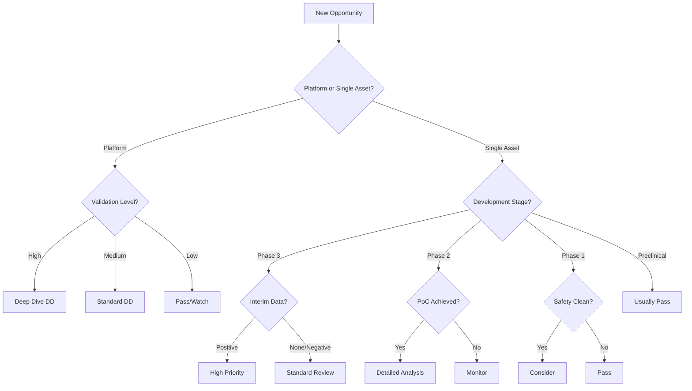
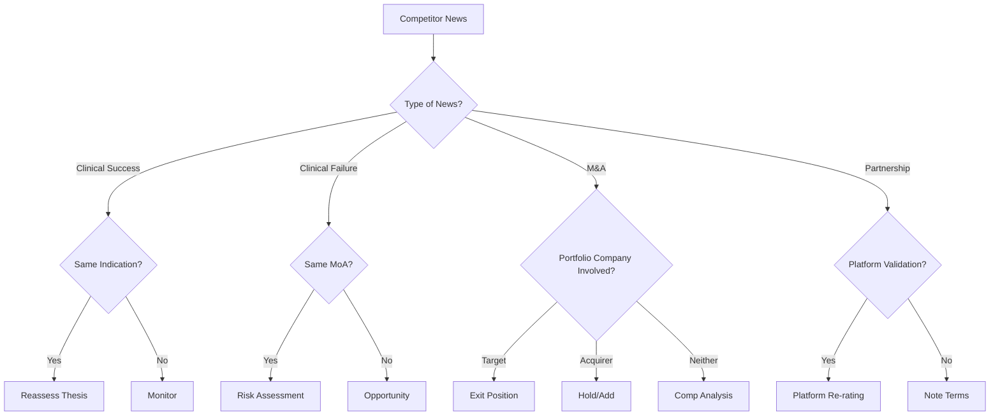

# Biotech-Specific Analysis Frameworks
*Standardizing Complexity Across Therapeutic Areas*
*Version 1.0 | Portfolio Management Edition*

## Introduction
Biotech investment analysis requires specialized frameworks due to the sector's scientific complexity, regulatory nuances, and diverse development pathways. This document provides standardized approaches for different therapeutic areas, company types, and development stages.

---

# SECTION 1: THERAPEUTIC AREA FRAMEWORKS

## 1.1 ONCOLOGY FRAMEWORK

### Primary Endpoints Hierarchy
```
REGISTRATIONAL TRIALS:
1. Overall Survival (OS) - Gold Standard
   - Median OS (months)
   - Hazard Ratio (HR) with 95% CI
   - p-value (typically <0.05 for approval)
   - Landmark survival (1-year, 2-year rates)

2. Progression-Free Survival (PFS) - Acceptable for Accelerated Approval
   - Median PFS
   - HR with 95% CI
   - IRC vs investigator assessment
   - PFS2 for maintenance studies

3. Objective Response Rate (ORR) - Single-arm trials
   - Complete Response (CR) %
   - Partial Response (PR) %
   - Duration of Response (DOR)
   - Time to Response (TTR)
```

### Safety Monitoring Requirements
| Toxicity Type | Key Metrics | Threshold for Concern |
|--------------|-------------|----------------------|
| Hematologic | Grade 3/4 neutropenia, thrombocytopenia | >30% Grade 3/4 |
| GI | Diarrhea, nausea, vomiting | >20% Grade 3/4 |
| Immune (for I-O) | irAEs, pneumonitis, colitis | Any Grade 5, >10% Grade 3/4 |
| Cardiac | QTc prolongation, ejection fraction | ΔQTc >20ms, EF drop >10% |

### Competitive Positioning Matrix
```python
def assess_oncology_competitive_position(drug_profile):
    score = 0
    
    # Efficacy superiority
    if drug_profile['HR'] < competitor_best['HR'] * 0.8:
        score += 3  # Significant improvement
    elif drug_profile['HR'] < competitor_best['HR']:
        score += 1  # Incremental improvement
    
    # Safety differentiation
    if drug_profile['grade34_rate'] < competitor_avg['grade34_rate'] * 0.7:
        score += 2  # Meaningful safety advantage
    
    # Convenience factors
    if drug_profile['dosing'] == 'oral' and competitor['dosing'] == 'IV':
        score += 2
    if drug_profile['frequency'] < competitor['frequency']:
        score += 1
    
    return score  # 0-3: weak, 4-5: competitive, 6+: highly differentiated
```

### Market Sizing Approach
1. **Incidence-based**: New patients × treatment rate × duration × price
2. **Prevalence-based**: Total patients × eligible % × market share × price
3. **Line of therapy**: 1L vs 2L+ (typically 1L = 100%, 2L = 40%, 3L = 15%)

---

## 1.2 RARE DISEASE FRAMEWORK

### Endpoint Complexity Management
```markdown
FUNCTIONAL ENDPOINTS (preferred by FDA):
- 6-Minute Walk Test (6MWT): MCID typically 30 meters
- Forced Vital Capacity (FVC): >5% change meaningful
- Motor function scales: Disease-specific (e.g., MFM-32, HFMSE)

BIOMARKER ENDPOINTS (supportive):
- Enzyme levels: >50% reduction typically required
- Substrate accumulation: Normalization preferred
- Genetic markers: Dystrophin, SMN protein levels

PATIENT-REPORTED OUTCOMES:
- Quality of life: SF-36, EQ-5D
- Disease-specific: PedsQL (pediatric)
- Caregiver burden: Often included for pediatric
```

### Regulatory Pathway Optimization
| Designation | Benefit | Requirements | Strategic Value |
|------------|---------|--------------|-----------------|
| Orphan Drug | 7-year exclusivity, tax credits | <200k patients US | High - blocks generics |
| Breakthrough | Rolling review, intensive FDA guidance | Preliminary evidence | High - faster approval |
| Rare Pediatric | Priority Review Voucher (~$100M value) | <18 years, <200k | Very High - sellable asset |
| Fast Track | Frequent FDA meetings, rolling review | Unmet need | Medium - process benefit |

### Pricing & Reimbursement Considerations
```
Ultra-Rare (<10,000 patients):
- Price: $300,000 - $3,000,000/year
- Payer approach: Individual case review
- Key evidence: Natural history comparison

Rare (10,000 - 200,000 patients):
- Price: $100,000 - $500,000/year
- Payer approach: Prior authorization
- Key evidence: Placebo-controlled trial

Special Considerations:
- Gene therapy: One-time pricing ($1M - $3M)
- Outcomes-based agreements common
- Centers of excellence model
```

---

## 1.3 CNS/NEUROLOGY FRAMEWORK

### Disease-Specific Endpoints

#### Alzheimer's Disease
```markdown
CLINICAL ENDPOINTS:
- CDR-SB: 1-2 point difference clinically meaningful
- ADAS-Cog: 3-4 point difference meaningful
- MMSE: 2-3 point change significant

BIOMARKERS (FDA accepts for accelerated approval):
- Amyloid PET: SUVr reduction >25%
- Tau PET: Regional spread limitation
- Plasma markers: Aβ42/40, p-tau217

FUNCTIONAL:
- ADL/iADL scales
- Caregiver burden measures
```

#### Multiple Sclerosis
```markdown
RELAPSING FORMS:
- Annualized Relapse Rate (ARR): >30% reduction
- MRI lesions: T2 new/enlarging, Gd+
- Disability (EDSS): Progression at 12/24 weeks

PROGRESSIVE FORMS:
- Confirmed Disability Progression (CDP)
- Brain atrophy: Whole brain, grey matter
- Walking speed: T25FW, 9HPT
```

#### Parkinson's Disease
```markdown
MOTOR SYMPTOMS:
- UPDRS Part III: >3 point improvement
- OFF time reduction: >1 hour/day
- Dyskinesia: UDysRS

NON-MOTOR:
- Cognitive: MoCA
- Psychiatric: NPI
- Autonomic dysfunction scales
```

### CNS Drug Development Challenges
1. **Blood-Brain Barrier**: Impacts delivery method
2. **Placebo Effect**: Often 20-30% in CNS trials
3. **Subjective Endpoints**: High variability
4. **Long Trial Duration**: Often 12-18+ months
5. **Biomarker Validation**: Still evolving

---

## 1.4 METABOLIC/CARDIOVASCULAR FRAMEWORK

### NASH/MASH Endpoints
```markdown
REGULATORY ACCEPTABLE:
- NAS improvement ≥2 with no worsening fibrosis
- Fibrosis improvement ≥1 stage with no worsening NASH
- Both required for full approval

SUPPORTIVE:
- Liver enzymes: ALT, AST normalization
- Non-invasive: FibroScan, MRI-PDFF
- Metabolic: Weight loss, A1C, lipids
```

### Cardiovascular Outcomes Trials (CVOTs)
```markdown
MACE COMPONENTS:
- CV death
- Non-fatal MI
- Non-fatal stroke
- (Sometimes: hospitalization for unstable angina)

STATISTICAL REQUIREMENTS:
- Non-inferiority first (HR upper bound <1.3)
- Then test superiority
- Typically need 600+ events
- Duration: 3-5 years
```

### Diabetes Positioning
| Drug Class | A1C Reduction | Weight Effect | CV Benefit | Key Differentiator |
|------------|---------------|---------------|------------|-------------------|
| GLP-1 | 1.0-1.5% | -5-15% | Yes (some) | Weight loss champion |
| SGLT-2 | 0.7-1.0% | -2-3% | Yes | Heart failure benefit |
| DPP-4 | 0.5-0.8% | Neutral | Neutral | Safety |
| Insulin | 1.5-2.5% | +2-4kg | Neutral | Efficacy |

---

# SECTION 2: COMPANY TYPE FRAMEWORKS

## 2.1 PLATFORM COMPANIES

### Assessment Criteria
```python
platform_score = {
    'validation': {
        'partnerships': count * avg_deal_value,
        'clinical_assets': programs_in_clinic,
        'approved_drugs': commercial_products
    },
    'scalability': {
        'new_targets': targets_per_year,
        'development_time': time_to_clinic,
        'capital_efficiency': cash_per_program
    },
    'moat': {
        'IP_breadth': patent_families,
        'manufacturing': proprietary_process,
        'data_advantage': proprietary_datasets
    }
}
```

### Platform Categories

#### mRNA Platforms
- **Validation**: COVID vaccines proven
- **Applications**: Vaccines, oncology, rare disease
- **Key Players**: Moderna, BioNTech, CureVac
- **Challenges**: Delivery, stability, redosing

#### Gene Editing
- **Technologies**: CRISPR, base editing, prime editing
- **Validation**: Sickle cell early success
- **Key Players**: CRISPR Therapeutics, Editas, Intellia
- **Challenges**: Delivery, off-target, manufacturing

#### Cell Therapy
- **Types**: CAR-T, TCR-T, TILs, NK cells
- **Validation**: 6 approved CAR-Ts
- **Key Players**: Gilead/Kite, BMS/Juno, Novartis
- **Challenges**: Manufacturing, cost, solid tumors

### Platform Valuation Methods
1. **Sum-of-Parts**: Value each program + platform option value
2. **Comparable Deals**: Recent platform partnerships
3. **NPV + Real Options**: Traditional NPV + call options on future programs

---

## 2.2 SINGLE-ASSET COMPANIES

### Risk Assessment Matrix
| Risk Factor | Weight | Assessment Method |
|------------|--------|-------------------|
| Clinical Risk | 40% | Phase, prior failures, biomarker |
| Regulatory Risk | 20% | Pathway clarity, FDA feedback |
| Commercial Risk | 20% | Market size, competition |
| Financial Risk | 20% | Cash runway, dilution potential |

### Binary Event Analysis
```markdown
PRE-BINARY EVENT CHECKLIST:
□ Trial fully enrolled
□ Interim looks disclosed
□ Statistical power adequate
□ Comparable trials analyzed
□ Options positioning reviewed
□ Cash through data + 6 months
□ Management incentives aligned
```

### Acquisition Probability Model
```python
def acquisition_probability(company):
    factors = {
        'clinical_success': 0.3,  # Weight
        'strategic_fit': 0.2,
        'competitive_bidding': 0.2,
        'management_willing': 0.15,
        'financial_need': 0.15
    }
    
    if company.phase == 3 and company.interim_positive:
        base_probability = 0.4
    elif company.phase == 2 and company.biomarker_positive:
        base_probability = 0.2
    else:
        base_probability = 0.1
    
    return base_probability * calculate_weighted_score(factors)
```

---

# SECTION 3: DEVELOPMENT STAGE FRAMEWORKS

## 3.1 PRECLINICAL STAGE

### Due Diligence Focus
1. **Scientific Validation**
   - Published peer-reviewed data
   - KOL opinions
   - Animal model relevance

2. **IP Landscape**
   - Freedom to operate
   - Composition of matter patents
   - Platform patents if applicable

3. **Team Assessment**
   - Prior drug development success
   - Scientific founder involvement
   - Board/advisor quality

### Valuation Approach
- **Method**: Venture comparables + option pricing
- **Typical Range**: $50M - $500M pre-money
- **Key Driver**: Platform potential vs single asset

---

## 3.2 PHASE 1 STAGE

### Safety Assessment Framework
```markdown
DOSE ESCALATION MONITORING:
- DLTs: Type, frequency, reversibility
- PK/PD: Linear vs non-linear
- MTD: Identified vs not reached
- RP2D: Rationale for selection

BIOMARKER SIGNALS:
- Target engagement confirmed
- Downstream pathway modulation
- Early efficacy signals (esp. oncology)
```

### Go/No-Go Criteria
| Signal | Phase 2 Probability | Investment Decision |
|--------|---------------------|-------------------|
| Clean safety, biomarker+ | 60-70% | Strong proceed |
| Clean safety, no biomarker | 30-40% | Conditional proceed |
| Manageable safety, biomarker+ | 40-50% | Proceed with caution |
| Safety concerns | <20% | Likely terminate |

---

## 3.3 PHASE 2 STAGE

### Proof-of-Concept Analysis
```python
def assess_phase2_poc(trial_results):
    poc_strength = 'None'
    
    # Efficacy threshold
    if trial_results['primary_met'] and trial_results['p_value'] < 0.05:
        poc_strength = 'Strong'
    elif trial_results['primary_trend'] and trial_results['p_value'] < 0.1:
        poc_strength = 'Moderate'
    elif trial_results['secondary_positive'] >= 2:
        poc_strength = 'Weak'
    
    # Competitive context
    if trial_results['efficacy'] > best_in_class * 1.2:
        poc_strength = upgrade(poc_strength)
    
    return poc_strength
```

### Phase 3 Design Implications
| Phase 2 Outcome | Phase 3 Strategy | Success Probability |
|-----------------|------------------|-------------------|
| Clear positive | Replicate design | 60-70% |
| Mixed results | Enrichment strategy | 40-50% |
| Subgroup benefit | Biomarker-selected | 50-60% |
| Marginal benefit | Larger trial/longer duration | 30-40% |

---

## 3.4 PHASE 3/REGISTRATION STAGE

### Pre-Approval Checklist
```markdown
CLINICAL:
□ Primary endpoint met with p<0.05
□ Key secondaries supportive
□ Safety database adequate (usually >1000 patients)
□ Subgroup analyses consistent

REGULATORY:
□ Pre-NDA meeting completed
□ Manufacturing site ready for inspection
□ REMS if required prepared
□ Label negotiations begun

COMMERCIAL:
□ Pricing strategy developed
□ Payer discussions initiated
□ KOL advocacy program
□ Supply chain established
```

### Launch Trajectory Modeling
```python
# First year sales prediction model
def predict_launch_sales(drug_profile):
    base_adoption = {
        'breakthrough': 0.15,  # 15% eligible patients
        'me_too': 0.05,        # 5% eligible patients
        'first_in_class': 0.10 # 10% eligible patients
    }
    
    modifiers = {
        'oral_vs_injectable': 1.3,
        'daily_vs_weekly': 0.9,
        'specialist_vs_pcp': 0.7,
        'biomarker_required': 0.6
    }
    
    peak_sales = market_size * peak_share
    year1_sales = peak_sales * base_adoption * calculate_modifiers(modifiers)
    
    return year1_sales
```

---

# SECTION 4: SPECIAL SITUATIONS

## 4.1 BIOSIMILARS

### Competitive Assessment
| Factor | Impact on Uptake | Weight |
|--------|------------------|--------|
| Price discount | 20-30% drives switching | 40% |
| Indication extrapolation | All vs partial | 20% |
| Device/formulation | Differentiation opportunity | 15% |
| Manufacturing capacity | Supply reliability | 15% |
| Commercial footprint | Education/support | 10% |

### Market Penetration Curves
- **Year 1**: 5-15% of reference product
- **Year 2**: 15-30%
- **Year 3**: 25-45%
- **Steady State**: 40-70% (varies by market)

---

## 4.2 GENE & CELL THERAPY

### Unique Considerations
```markdown
MANUFACTURING:
- Slot availability (for autologous)
- Scale-up challenges
- COGs evolution
- Quality consistency

DELIVERY:
- Treatment center requirements
- Patient journey complexity
- Vein-to-vein time (CAR-T)
- One-time vs redosing (gene therapy)

PAYMENT:
- Outcomes-based agreements
- Annuity vs upfront
- Stop-loss insurance
- Centers of excellence model
```

### Valuation Framework
```python
def value_gene_therapy(profile):
    # One-time treatment modeling
    patients = prevalence * diagnosis_rate * eligible_rate
    
    # Price justification
    if profile['curative_potential']:
        price = lifetime_cost_current_SOC * 0.5
    else:
        price = annual_cost_SOC * years_benefit * 0.7
    
    # Adoption curve (slower than traditional)
    year_sales = []
    for year in range(1, 11):
        penetration = sigmoid_curve(year, midpoint=4, steepness=0.5)
        year_sales.append(patients * penetration * price)
    
    return npv(year_sales, discount_rate=0.10)
```

---

## 4.3 COMBINATION THERAPIES

### Development Strategy
1. **Monotherapy First**: Establish single-agent activity
2. **Rational Combinations**: Scientific rationale required
3. **Dose Finding**: Multiple dose levels/schedules
4. **Registration Strategy**: Often need combo from start

### Commercial Considerations
- **Pricing**: Premium for combo vs additive pricing
- **Access**: Single payer decision vs multiple
- **Competition**: Fixed-dose vs free combination
- **IP**: Combination patents often weaker

---

# SECTION 5: VALUATION METHODOLOGIES

## 5.1 RISK-ADJUSTED NPV (rNPV)

### Probability of Success (PoS) by Phase
| Phase | Oncology | CNS | CV/Met | Rare Disease | Platform Validation |
|-------|----------|-----|--------|--------------|-------------------|
| Preclinical → Phase 1 | 70% | 65% | 70% | 75% | 60% |
| Phase 1 → Phase 2 | 55% | 50% | 60% | 65% | 50% |
| Phase 2 → Phase 3 | 40% | 35% | 45% | 55% | N/A |
| Phase 3 → Approval | 65% | 60% | 70% | 75% | N/A |
| **Overall** | **10%** | **7%** | **13%** | **21%** | **Variable** |

### Discount Rate Selection
```python
def select_discount_rate(company_profile):
    base_rate = 0.10  # 10% pharma baseline
    
    adjustments = {
        'development_stage': {
            'preclinical': 0.05,
            'phase1': 0.03,
            'phase2': 0.02,
            'phase3': 0.01,
            'commercial': 0.00
        },
        'company_risk': {
            'single_asset': 0.02,
            'platform': -0.01,
            'profitable': -0.02
        },
        'indication_risk': {
            'high_risk': 0.02,  # CNS, psychiatry
            'medium_risk': 0.01,  # Oncology
            'low_risk': 0.00  # Metabolic
        }
    }
    
    total_rate = base_rate
    for category, factors in adjustments.items():
        total_rate += factors.get(company_profile[category], 0)
    
    return min(max(total_rate, 0.08), 0.20)  # Cap between 8-20%
```

---

## 5.2 COMPARABLE COMPANY ANALYSIS

### Peer Selection Criteria
1. **Therapeutic Area**: Same or adjacent
2. **Development Stage**: ±1 phase acceptable
3. **Market Cap**: 0.5x - 2x range
4. **Geography**: Same regulatory jurisdiction
5. **Time Period**: Last 24 months for deals

### Multiple Adjustments
```markdown
ADJUSTMENTS TO COMPS:
- Efficacy differentiation: ±20%
- Safety profile: ±15%
- Market size difference: ±30%
- Competitive dynamics: ±25%
- Management track record: ±10%
```

---

## 5.3 REAL OPTIONS VALUATION

### When to Use
- Platform companies with multiple shots on goal
- Early-stage with high uncertainty
- Expansion opportunities (indications, geographies)

### Black-Scholes Application
```python
def platform_option_value(platform):
    from scipy.stats import norm
    import numpy as np
    
    # Parameters
    S = platform['current_value']  # Current asset value
    K = platform['investment_required']  # Exercise price
    T = platform['time_to_decision']  # Years
    r = 0.03  # Risk-free rate
    σ = 0.60  # Biotech volatility
    
    # Black-Scholes
    d1 = (np.log(S/K) + (r + σ**2/2)*T) / (σ*np.sqrt(T))
    d2 = d1 - σ*np.sqrt(T)
    
    call_value = S*norm.cdf(d1) - K*np.exp(-r*T)*norm.cdf(d2)
    
    return call_value
```

---

# SECTION 6: QUICK DECISION TREES

## 6.1 Investment Decision Tree



## 6.2 Competitive Response Tree



---

# SECTION 7: TEMPLATES & CHECKLISTS

## 7.1 New Coverage Initiation Checklist

```markdown
WEEK 1: Foundation
□ Pipeline deep dive
□ Management assessment
□ IP landscape review
□ Financial model v1
□ Comparable companies identified

WEEK 2: Deep Dive
□ KOL calls (minimum 3)
□ Competitive intelligence
□ Regulatory pathway analysis
□ Payer/pricing research
□ Model refinement

WEEK 3: Synthesis
□ Investment thesis drafted
□ Risk/reward framework
□ Catalyst timeline
□ Position sizing recommendation
□ Final dossier production
```

## 7.2 Earnings/Data Review Template

```markdown
IMMEDIATE (Within 1 hour):
1. Headlines: Beat/Miss/In-line
2. Key metrics vs consensus
3. Guidance changes
4. Pipeline updates
5. Stock reaction

DETAILED (Within 24 hours):
1. Financial analysis
   - Revenue by product
   - Expense trends
   - Cash runway update
   - Financing needs

2. Pipeline progress
   - Trial enrollment
   - Timeline updates
   - New programs
   - Discontinuations

3. Competitive dynamics
   - Market share trends
   - New entrants
   - Pricing pressure

4. Thesis impact
   - Confirmation/challenge
   - Probability adjustments
   - Target price revision
```

## 7.3 Red Flags Checklist

```markdown
CLINICAL RED FLAGS:
⚠️ Delayed trial enrollment
⚠️ Protocol amendments mid-trial
⚠️ DMC recommendations not disclosed
⚠️ Statistical plan changes
⚠️ Missing secondary endpoints

MANAGEMENT RED FLAGS:
🚩 CEO/CMO departure near data
🚩 Insider selling patterns
🚩 Guidance pulled
🚩 Auditor changes
🚩 SEC investigation

FINANCIAL RED FLAGS:
💰 Going concern warning
💰 ATM usage acceleration
💰 Covenant breaches
💰 Working capital deficits
💰 Related party transactions
```

---

# APPENDIX: COMMON BIOTECH METRICS

## Efficacy Metrics Glossary

| Metric | Definition | Typical Threshold |
|--------|------------|-------------------|
| OS | Overall Survival | HR <0.75 meaningful |
| PFS | Progression-Free Survival | HR <0.60 meaningful |
| ORR | Objective Response Rate | >20% in refractory |
| DOR | Duration of Response | >6 months minimum |
| CR | Complete Response | >10% impressive |
| MRD | Minimal Residual Disease | <10^-4 target |
| pCR | Pathologic Complete Response | >20% improvement |
| SVR | Sustained Virologic Response | >95% expected |

## Financial Metrics Reference

| Metric | Calculation | Benchmark |
|--------|------------|-----------|
| Burn Rate | (Cash_start - Cash_end) / Quarters | <$50M/Q sustainable |
| Runway | Cash / Quarterly Burn | >12 months minimum |
| Enterprise Value | Market Cap + Debt - Cash | - |
| EV/Sales | EV / Annual Revenue | 3-6x typical |
| P/E (profitable) | Price / EPS | 15-25x sector |

## Statistical Terms

| Term | Meaning | Investment Impact |
|------|---------|-------------------|
| p-value | Probability by chance | <0.05 for approval |
| CI | Confidence Interval | 95% standard |
| HR | Hazard Ratio | <1 = benefit |
| NNT | Number Needed to Treat | Lower is better |
| ITT | Intention to Treat | Conservative |
| PP | Per Protocol | Optimistic |

---

*End of Biotech-Specific Frameworks*
*Document 3 of 10*