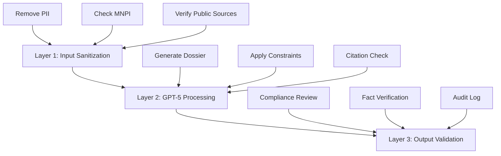

# ChatGPT 5 Pro Migration Guide
*Enterprise Deployment for Biotech Investment Dossiers*
*Compliance-Ready Implementation*

## Executive Overview

ChatGPT 5 Pro offers enterprise-grade AI capabilities with enhanced compliance features, making it suitable for regulated financial environments. This guide provides step-by-step migration from current processes to ChatGPT 5 Pro-powered dossier generation.

**Key Advantages:**
- Enterprise security & compliance
- No training on proprietary data
- Audit trail capabilities
- API integration options
- Consistent output quality

**Key Limitations:**
- No real-time web search
- Token limits per request
- No custom fine-tuning
- Requires source pre-loading

---

# SECTION 1: TECHNICAL SETUP

## 1.1 Enterprise Account Configuration

### Initial Setup Checklist
```markdown
WEEK 1 TASKS:
□ Obtain enterprise license approval
□ Configure SSO integration
□ Set up user roles and permissions
□ Enable audit logging
□ Configure data retention policies
□ Test compliance mode
□ Set up secure workspaces
□ Enable API access (if needed)
```

### Security Configuration
```json
{
  "enterprise_settings": {
    "data_retention": "none",
    "training_on_inputs": false,
    "audit_logging": true,
    "compliance_mode": "financial_services",
    "ip_whitelist": ["company_range"],
    "mfa_required": true,
    "api_rate_limits": {
      "requests_per_minute": 60,
      "tokens_per_minute": 90000
    }
  }
}
```

### User Access Matrix
| Role | Access Level | Capabilities | Restrictions |
|------|--------------|--------------|--------------|
| Portfolio Manager | Full | Create, edit, approve | No system config |
| Senior Analyst | Standard | Create, edit | No approval rights |
| Analyst | Limited | Create, view | No edit after submit |
| Compliance | Audit | View all, export logs | No creation |
| IT Admin | Admin | All system settings | No content creation |

---

## 1.2 Prompt Adaptation for GPT-5

### Key Differences from Claude

| Feature | Claude Approach | GPT-5 Pro Adaptation |
|---------|----------------|---------------------|
| Web Search | Real-time search | Pre-load sources |
| Token Limit | ~100k | ~32k (optimize) |
| Citations | Inline supported | Explicit formatting |
| Consistency | ULTRATHINK | Chain-of-thought |
| Output | Single pass | May need chunks |

### Optimized GPT-5 Prompt Structure

```markdown
# BIOTECH DOSSIER PROMPT v3.0 - GPT-5 PRO OPTIMIZED

## CRITICAL INSTRUCTIONS
You are a senior biotech equity analyst creating an investment dossier.
IMPORTANT: Follow the EXACT format specified below. Any deviation fails.

## INPUT CONTEXT
[INSERT PRE-LOADED SOURCE DOCUMENTS HERE - MAX 20K TOKENS]
- Latest 10-Q/10-K excerpts
- Recent press releases
- Clinical trial summaries
- Competitive intelligence

## OUTPUT REQUIREMENTS

### PART 1: EXECUTIVE SUMMARY (200 words max)
Provide:
1. Company positioning (1 sentence)
2. Lead programs status (2 sentences)
3. Financial position (1 sentence)
4. Investment thesis with bull/bear tension (2 sentences)

### PART 2: KEY DEVELOPMENTS
Create a markdown table with EXACTLY these columns:
| Date | Event | Interpretation |

Include 5-7 events from the last 12 months.
Each interpretation must be <20 words.

[Continue with all sections...]

## VERIFICATION REQUIREMENTS
- Every number MUST have [#] citation
- If data not in provided sources, write "DATA NOT PROVIDED"
- Do not infer or estimate missing data
- Maintain exact format specified above

## QUALITY CHECKS
Before outputting, verify:
1. All sections present in order
2. Every quantitative claim has citation
3. No data fabricated beyond sources
4. Format exactly as specified
```

---

## 1.3 Source Document Management

### Pre-Processing Pipeline
```python
class SourceDocumentProcessor:
    def __init__(self):
        self.max_tokens = 20000  # Leave room for prompt
        self.documents = []
    
    def process_10k(self, filing_path):
        """Extract key sections from 10-K/Q"""
        sections_to_extract = [
            'Business Overview',
            'Risk Factors (first 2 pages)',
            'MD&A - Liquidity',
            'Financial Statements - Balance Sheet',
            'Clinical Programs Update'
        ]
        
        extracted = self.extract_sections(filing_path, sections_to_extract)
        return self.compress_text(extracted, max_tokens=5000)
    
    def process_press_releases(self, pr_list):
        """Summarize recent PRs"""
        critical_prs = []
        for pr in pr_list:
            if self.is_material(pr):
                summary = self.summarize_pr(pr, max_tokens=500)
                critical_prs.append(summary)
        return '\n'.join(critical_prs)
    
    def create_source_package(self, ticker):
        """Compile all sources for GPT-5"""
        package = {
            'metadata': {
                'ticker': ticker,
                'generated': datetime.now(),
                'token_count': 0
            },
            'sources': {
                'financial': self.process_10k(f"{ticker}_10Q.pdf"),
                'clinical': self.get_clinical_data(ticker),
                'competitive': self.get_competitive_intel(ticker),
                'news': self.process_press_releases(ticker)
            }
        }
        
        # Ensure within token limit
        package['metadata']['token_count'] = self.count_tokens(package)
        return package
```

### Source Package Template
```markdown
# SOURCE PACKAGE FOR [COMPANY] - [DATE]

## FINANCIAL DATA (Source: 10-Q dated YYYY-MM-DD)
Cash and equivalents: $XXX.X million
Quarterly burn rate: $XX.X million
Debt: [None / $XXX million due YYYY]
Recent financing: [Description]

## CLINICAL PROGRAMS
Program 1: [Name]
- Phase: [X]
- Indication: [Disease]
- Enrollment: XX/XXX patients
- Primary endpoint: [Endpoint]
- Timeline: [Topline Q# YYYY]

[Continue for all programs...]

## COMPETITIVE LANDSCAPE
Direct Competitors:
1. [Company] - [Drug] - [Phase] - [Differentiation]
2. [Company] - [Drug] - [Phase] - [Differentiation]

## RECENT DEVELOPMENTS
1. [Date]: [Event] - [Impact]
2. [Date]: [Event] - [Impact]

[END OF SOURCE PACKAGE]
```

---

# SECTION 2: WORKFLOW INTEGRATION

## 2.1 Compliant Workflow Design

### Three-Layer Compliance Architecture


### Standard Operating Procedure
```python
def compliant_dossier_generation(ticker, analyst_id):
    """
    Compliance-approved workflow for GPT-5 Pro
    """
    # Step 1: Authentication & Authorization
    if not authenticate_user(analyst_id):
        return "Unauthorized"
    
    # Step 2: Source Preparation
    sources = prepare_sources(ticker)
    if contains_mnpi(sources):
        log_compliance_issue(analyst_id, ticker, "MNPI detected")
        return "Compliance block"
    
    # Step 3: GPT-5 Generation
    prompt = load_approved_prompt("dossier_v3.0")
    response = gpt5_pro.generate(
        prompt=prompt,
        context=sources,
        temperature=0.3,  # Low for consistency
        compliance_mode=True
    )
    
    # Step 4: Validation
    validation = validate_output(response)
    if not validation.passed:
        return handle_validation_failure(validation.errors)
    
    # Step 5: Audit Trail
    audit_log.record({
        'analyst': analyst_id,
        'ticker': ticker,
        'timestamp': datetime.now(),
        'source_hash': hash(sources),
        'output_hash': hash(response),
        'status': 'SUCCESS'
    })
    
    return response
```

---

## 2.2 Prompt Engineering for GPT-5 Pro

### Optimized Prompt Components

#### 1. Role Definition (Enhanced for GPT-5)
```markdown
You are a senior biotech equity analyst at a leading investment firm.
Your expertise includes:
- FDA regulatory pathways
- Clinical trial interpretation
- Biotech financial analysis
- Competitive positioning
- Risk assessment

CRITICAL: You must base ALL statements on the provided source documents.
Do not access external knowledge beyond what's provided.
```

#### 2. Chain-of-Thought Prompting
```markdown
Before generating each section, internally verify:
1. Is the required data in the sources? (If no → "DATA NOT PROVIDED")
2. What is the primary source for this claim? (Cite it)
3. Is the interpretation reasonable? (Conservative bias)
4. Does it match the required format? (Exact compliance)

Now generate the section following these verified points.
```

#### 3. Few-Shot Examples (Critical for GPT-5)
```markdown
EXAMPLE - Key Developments Table:
| Date | Event | Interpretation |
|---|---|---|
| 2024-03-15 | Phase 3 trial met primary endpoint [1] | De-risks regulatory path |
| 2024-04-20 | $200M financing completed [2] | Extends runway to 2026 |

Your table should follow this EXACT format.
```

### Common GPT-5 Issues & Solutions

| Issue | Symptom | Solution |
|-------|---------|----------|
| Hallucination | Creates data not in sources | Stronger constraints, explicit "DATA NOT PROVIDED" |
| Format drift | Inconsistent structure | More examples, rigid templates |
| Citation gaps | Missing [#] markers | Post-processing validation |
| Token overflow | Truncated output | Chunk into sections |
| Inconsistency | Different outputs same input | Lower temperature (0.2-0.3) |

---

## 2.3 Quality Assurance for GPT-5

### Automated Validation Suite
```python
class GPT5OutputValidator:
    def __init__(self):
        self.errors = []
        self.warnings = []
    
    def validate_structure(self, output):
        """Check all sections present"""
        required_sections = [
            '# Executive Summary',
            '# Key developments',
            '# Catalysts',
            '# Programs / Pipeline',
            '# Financials',
            '# Bull / Bear Views'
        ]
        
        for section in required_sections:
            if section not in output:
                self.errors.append(f"Missing section: {section}")
    
    def validate_citations(self, output, sources):
        """Verify all citations traceable to sources"""
        citations = re.findall(r'\[(\d+)\]', output)
        
        for cite_num in citations:
            # Check if citation exists in source list
            if not self.citation_in_sources(cite_num, sources):
                self.errors.append(f"Citation [{cite_num}] not found in sources")
    
    def validate_data_accuracy(self, output, sources):
        """Cross-check numbers against sources"""
        numbers_in_output = self.extract_numbers(output)
        numbers_in_sources = self.extract_numbers(sources)
        
        for number in numbers_in_output:
            if not self.fuzzy_match(number, numbers_in_sources):
                self.warnings.append(f"Number {number} not verified in sources")
    
    def generate_report(self):
        return {
            'passed': len(self.errors) == 0,
            'errors': self.errors,
            'warnings': self.warnings,
            'timestamp': datetime.now()
        }
```

---

# SECTION 3: MIGRATION EXECUTION

## 3.1 Phased Migration Plan

### Phase 1: Pilot (Weeks 1-2)
```markdown
OBJECTIVES:
- Test GPT-5 Pro with 5 companies
- Compare output quality with manual process
- Identify prompt adjustments needed
- Train core team

DELIVERABLES:
□ 5 test dossiers generated
□ Quality comparison report
□ Prompt v3.1 refined
□ Training materials created

SUCCESS CRITERIA:
- 90% format compliance
- <10% error rate
- Positive user feedback
```

### Phase 2: Parallel Run (Weeks 3-4)
```markdown
OBJECTIVES:
- Run GPT-5 alongside existing process
- Validate output consistency
- Build source document library
- Refine workflows

DELIVERABLES:
□ 20 companies covered
□ Source templates created
□ Workflow documentation
□ Compliance sign-off

SUCCESS CRITERIA:
- Output quality matches manual
- Time savings >50%
- Compliance approved
```

### Phase 3: Production (Weeks 5-6)
```markdown
OBJECTIVES:
- Full production deployment
- Team-wide rollout
- Automation implementation
- Performance monitoring

DELIVERABLES:
□ 50+ companies covered
□ Automated pipelines
□ Monitoring dashboard
□ ROI analysis

SUCCESS CRITERIA:
- Adoption rate >80%
- Error rate <5%
- Cost reduction achieved
```

---

## 3.2 Change Management

### Training Program
```markdown
MODULE 1: GPT-5 Pro Basics (2 hours)
- Interface navigation
- Prompt engineering
- Output interpretation
- Troubleshooting

MODULE 2: Compliance Requirements (1 hour)
- Data handling rules
- Audit trail maintenance
- Prohibited activities
- Escalation procedures

MODULE 3: Hands-On Practice (3 hours)
- Generate test dossier
- Review and correct output
- Source document preparation
- Quality validation

MODULE 4: Advanced Features (2 hours)
- API integration
- Batch processing
- Custom workflows
- Performance optimization
```

### Communication Plan
| Week | Audience | Message | Channel |
|------|----------|---------|---------|
| -1 | All Staff | Migration announcement | Email |
| 1 | Pilot Team | Training schedule | Meeting |
| 2 | Management | Pilot results | Presentation |
| 3 | All Analysts | Rollout timeline | Workshop |
| 4 | Clients | Enhancement notice | Letter |
| 6 | Board | ROI report | Board meeting |

---

# SECTION 4: COMPLIANCE & GOVERNANCE

## 4.1 Regulatory Compliance Framework

### Data Governance Policies
```markdown
PERMITTED USES:
✅ Public company information
✅ Published clinical data
✅ SEC filings
✅ Press releases
✅ Conference presentations

PROHIBITED USES:
❌ Material non-public information
❌ Internal projections beyond guidance
❌ Proprietary models
❌ Client confidential data
❌ Personal identifiable information
```

### Audit Trail Requirements
```sql
-- Audit table structure
CREATE TABLE gpt5_audit_log (
    id UUID PRIMARY KEY,
    user_id VARCHAR(50) NOT NULL,
    timestamp TIMESTAMP NOT NULL,
    action VARCHAR(20) NOT NULL,
    ticker VARCHAR(10),
    prompt_version VARCHAR(10),
    input_hash VARCHAR(64),
    output_hash VARCHAR(64),
    error_flag BOOLEAN DEFAULT FALSE,
    compliance_flag BOOLEAN DEFAULT FALSE,
    review_status VARCHAR(20),
    reviewer_id VARCHAR(50),
    comments TEXT
);

-- Compliance query examples
-- Daily usage report
SELECT user_id, COUNT(*) as generations, 
       SUM(CASE WHEN error_flag THEN 1 ELSE 0 END) as errors
FROM gpt5_audit_log
WHERE DATE(timestamp) = CURRENT_DATE
GROUP BY user_id;

-- Compliance violations
SELECT * FROM gpt5_audit_log
WHERE compliance_flag = TRUE
ORDER BY timestamp DESC;
```

---

## 4.2 Risk Mitigation Strategies

### Technical Risks
| Risk | Probability | Impact | Mitigation |
|------|------------|--------|------------|
| API outage | Low | High | Fallback to manual process |
| Token limits | Medium | Medium | Chunk large requests |
| Inconsistent output | Medium | Low | Standardize prompts, low temperature |
| Data leakage | Low | Critical | Compliance mode, audit trails |

### Operational Risks
```python
def risk_assessment_framework():
    risks = {
        'hallucination': {
            'detection': 'Cross-reference all numbers',
            'prevention': 'Constrained prompts',
            'response': 'Human verification required'
        },
        'compliance_breach': {
            'detection': 'Automated MNPI scanning',
            'prevention': 'Training and controls',
            'response': 'Immediate escalation to compliance'
        },
        'quality_degradation': {
            'detection': 'Daily quality metrics',
            'prevention': 'Continuous prompt refinement',
            'response': 'Revert to previous version'
        }
    }
    return risks
```

---

# SECTION 5: OPTIMIZATION & SCALING

## 5.1 Performance Optimization

### Prompt Optimization Techniques
```markdown
1. TOKEN ECONOMY
- Remove redundant instructions
- Use abbreviations consistently
- Compress source documents
- Eliminate examples after training

2. RESPONSE QUALITY
- Temperature: 0.2-0.3 for consistency
- Top-p: 0.9 for focused outputs
- Frequency penalty: 0.2 to reduce repetition
- Presence penalty: 0.1 for variety

3. SPEED OPTIMIZATION
- Parallel processing for sections
- Caching common components
- Batch similar requests
- Pre-compile source packages
```

### Scaling Architecture
```python
class GPT5ScalingSystem:
    def __init__(self):
        self.queue = Queue()
        self.workers = []
        self.cache = {}
    
    def scale_horizontally(self, num_workers=5):
        """Add parallel processing capability"""
        for i in range(num_workers):
            worker = DossierWorker(f"worker_{i}")
            self.workers.append(worker)
            worker.start()
    
    def intelligent_routing(self, request):
        """Route based on complexity"""
        if request.complexity == 'simple':
            return self.cache.get(request.ticker, 
                                 self.simple_generation(request))
        elif request.complexity == 'complex':
            return self.detailed_generation(request)
        else:
            return self.standard_generation(request)
    
    def batch_processing(self, tickers):
        """Process multiple companies efficiently"""
        # Group by sector for context sharing
        sectors = self.group_by_sector(tickers)
        
        results = []
        for sector, companies in sectors.items():
            sector_context = self.load_sector_context(sector)
            for company in companies:
                result = self.generate_with_context(company, sector_context)
                results.append(result)
        
        return results
```

---

## 5.2 Cost Management

### Cost Optimization Strategies
```markdown
TIER 1: IMMEDIATE SAVINGS
- Reduce prompt verbosity (-20% tokens)
- Cache repeated sections (-15% requests)
- Batch processing (-10% API calls)
- Optimize temperature settings (-5% retries)

TIER 2: STRUCTURAL OPTIMIZATION
- Implement tiered generation (simple vs complex)
- Share context across similar companies
- Pre-process and compress sources
- Implement smart routing

TIER 3: ADVANCED OPTIMIZATION
- Fine-tune smaller models for specific tasks
- Implement hybrid human-AI workflow
- Build proprietary pre-processing
- Negotiate enterprise pricing
```

### ROI Calculation Model
```python
def calculate_gpt5_roi(implementation_costs, operational_metrics):
    """
    Calculate return on investment for GPT-5 Pro implementation
    """
    # Costs
    initial_setup = implementation_costs['setup']  # €10,000
    monthly_license = implementation_costs['license']  # €2,000
    training_costs = implementation_costs['training']  # €5,000
    
    # Benefits (per month)
    time_saved_hours = operational_metrics['hours_saved']  # 200
    hourly_rate = operational_metrics['analyst_rate']  # €100
    quality_improvement = operational_metrics['error_reduction']  # 0.8
    coverage_expansion = operational_metrics['coverage_increase']  # 2x
    
    monthly_benefit = (
        time_saved_hours * hourly_rate +
        quality_improvement * 5000 +  # Error cost avoidance
        coverage_expansion * 10000  # Value of expanded coverage
    )
    
    monthly_roi = (monthly_benefit - monthly_license) / monthly_license
    payback_period = (initial_setup + training_costs) / (monthly_benefit - monthly_license)
    
    return {
        'monthly_roi_percent': monthly_roi * 100,
        'payback_months': payback_period,
        'annual_value': monthly_benefit * 12 - monthly_license * 12
    }
```

---

# SECTION 6: TROUBLESHOOTING & SUPPORT

## 6.1 Common Issues Resolution

### Issue Resolution Matrix
| Issue | Symptoms | Quick Fix | Long-term Solution |
|-------|----------|-----------|-------------------|
| Timeout | Generation stops | Reduce token count | Optimize prompts |
| Hallucination | False data | Add constraints | Improve sources |
| Format issues | Broken tables | Provide examples | Template enforcement |
| Citation errors | Missing [#] | Post-processing | Prompt refinement |
| Inconsistency | Variable output | Lower temperature | Standardize inputs |

### Debugging Checklist
```markdown
WHEN OUTPUT IS INCORRECT:
1. Check source documents
   - Are all required data present?
   - Are sources properly formatted?
   - Is context within token limit?

2. Review prompt
   - Are instructions clear?
   - Are constraints specified?
   - Are examples provided?

3. Verify settings
   - Temperature appropriate? (0.2-0.3)
   - Token limit sufficient?
   - Compliance mode enabled?

4. Test incrementally
   - Generate one section at a time
   - Identify problem section
   - Refine specific instructions

5. Escalation path
   - Try regeneration (3x max)
   - Adjust parameters
   - Contact support
   - Fallback to manual
```

---

## 6.2 Support Resources

### Internal Support Structure
```markdown
TIER 1: Self-Service
- Documentation wiki
- Video tutorials
- FAQ database
- Prompt library

TIER 2: Peer Support
- Slack channel #gpt5-help
- Weekly office hours
- Buddy system
- Best practices sharing

TIER 3: Expert Support
- Technical lead escalation
- Vendor support ticket
- Compliance consultation
- Emergency hotline
```

### External Resources
| Resource | Purpose | Access |
|----------|---------|--------|
| OpenAI Enterprise Support | Technical issues | support@openai.com |
| API Documentation | Integration help | api.openai.com/docs |
| Community Forum | Best practices | community.openai.com |
| Training Platform | Skill development | learn.openai.com |

---

# APPENDICES

## Appendix A: Prompt Library

### A.1 Base Dossier Prompt (GPT-5 Optimized)
```markdown
[Full 2000-word optimized prompt]
[Included in separate file: prompts/gpt5_dossier_v3.0.md]
```

### A.2 Sector-Specific Variations
```markdown
ONCOLOGY VARIANT:
- Additional focus on trial design
- Competitive enrollment rates
- RECIST criteria interpretation

RARE DISEASE VARIANT:
- Natural history comparisons
- Caregiver burden metrics
- Orphan drug economics

PLATFORM VARIANT:
- Technology validation
- Partnership potential
- Pipeline productivity metrics
```

## Appendix B: Integration Code Samples

### B.1 Python Integration
```python
# See full code at: /integrations/gpt5_python_client.py
```

### B.2 API Wrapper
```python
# See full code at: /integrations/gpt5_api_wrapper.py
```

## Appendix C: Compliance Templates

### C.1 Disclaimer Language
```markdown
STANDARD DISCLAIMER:
"This document was generated using GPT-5 Pro AI technology and has been reviewed by qualified investment professionals. The analysis is based solely on publicly available information as of [DATE]. This is not investment advice. Please independently verify all critical information before making investment decisions."
```

### C.2 Audit Report Template
```markdown
[Included in separate file: templates/audit_report.md]
```

---

# QUICK START GUIDE

## Day 1: Get Started in 5 Steps

1. **Access Setup**
   ```
   → Go to enterprise.openai.com
   → Login with SSO
   → Select "Financial Services" workspace
   ```

2. **First Dossier**
   ```
   → Click "New Chat"
   → Paste prompt template
   → Insert company sources
   → Generate
   ```

3. **Quality Check**
   ```
   → Verify structure
   → Check citations
   → Validate numbers
   ```

4. **Save & Document**
   ```
   → Export to markdown
   → Log in tracker
   → Note any issues
   ```

5. **Iterate**
   ```
   → Refine prompt
   → Test again
   → Document improvements
   ```

---

*End of ChatGPT 5 Pro Migration Guide*
*Version 1.0 - Enterprise Edition*
*Support: [Your Email]*
*Last Updated: 2025-08-25*